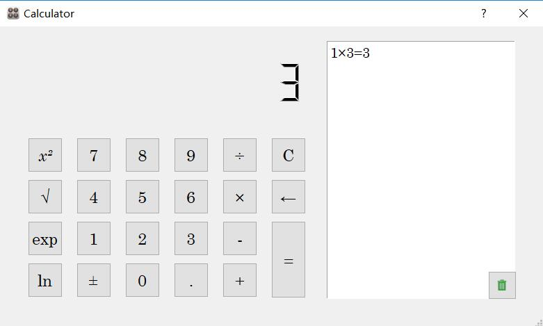

This is a calculator. 

It is designed by using eric6 and PyQt5.

Ui_UI_calculator.py is generated from eric6 automatically after the design. And the dlg_calculator.py and calculate.py is to realize all the functions of our calculator.

Run the exe file. You can control it by your keyboard.

